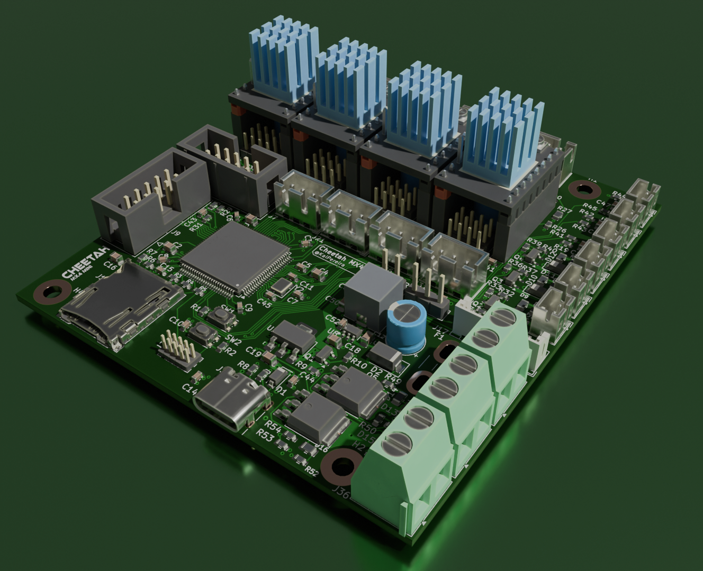

# Cheetah MX4 Mini Motherboard

The Cheetah MX4 Mini, is a powerful, yet affordable 3D printer motherboard. At just 80x90mm wide, this is an extremely compact motherboard that absolutely packs a punch!
## Custom Features
- 4 TMC stepstick drivers that support UART and SPI
- Sensorless and endstop homing configured using jumpers
- 3 Thermistor input connectors
- Support for parallel and SD card LCD's and TFT displays
- 3 Fan output connectors
- Support for the BLTouch Probe (servo and probe connectors too)
- 2 High amperage heater outputs for a bed and miscellaneous
- Powerful STM32H743VIT6 LQFP100 MCU
- Support for USB-C and SD-Card printing
- 4x M3 grounded mounting holes

## PCB Design

The Cheetah MX4 Mini is a complex 4 layer PCB with dedicated power and ground layers.

It's built off the powerful STM32H series MCU to support every function you need for a printer. It's got many protection circuits, good decoupling, and is designed around high current inputs.

To power it, you can supply either USB-C for development, or a 12/24V PSU to drive the motors and all the other parts like the drivers.

You can upload prints via USB-C or SD Card, with support for UART and SPI drivers, and you can hot-swap the motor drivers for maximum control.

## Firmware

The Cheetah MX4 Mini uses an STM32H743VIT6 MCU, so it has support for both Marlin, Klipper and most other 3D printer firmwares!

To get started, you can upload firmware to the onboard flash using the dedicated boot and reset pins!

More information on firmware *coming soon...*

## BOM (Bill of Materials)

I've created a BOM for JLCPCB and a general footprint BOM if you want to get PCBA from somewhere else like PCBWay or something.

The JLCPCB BOM is actually relatively cheap, coming in at about $150 for all 5 boards which I was pretty impressed with!

You can find the JLCPCB BOM [here](BOM_JLCPCB.xls).

## Credits

Thanks so much to @Fisheiyy and for the folks on Reddit for reviewing and helping me with the board, without them, this board probably would have never worked or come to fruition!
